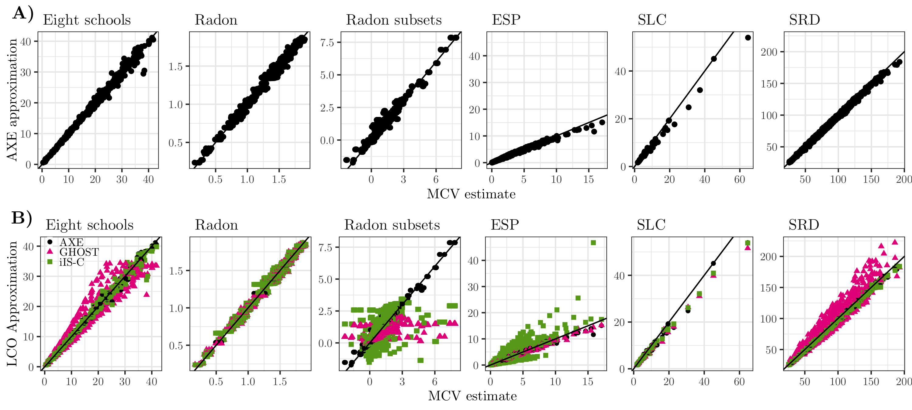

```{r setup, include=FALSE}
knitr::opts_chunk$set(echo = TRUE)
```

# AXE: (A)pproximate (X)Cross-validated (E)stimates for Bayesian hierarchical regression models

This R package provides code and data to reproduce all examples from the paper

Zhang, A. X., Bao, L., & Daniels, M. J. (2020). Approximate Cross-validated Mean Estimates for Bayesian Hierarchical Regression Models. [_arXiv preprint arXiv:2011.14238_](https://arxiv.org/abs/2011.14238).

The paper presents a novel method for approximating $E[Y_j | Y_{-j}]$, where $Y_j$ is the vector of test data, and $Y_{-j}$ a vector of training data. 


## AXE method
Let $Y \in I\!\!R$ denote a continuous response vector that follows

$$ Y | \beta, \tau \sim N(X_1\beta_1 + X_2\beta_2, \tau^2I), \\
 \beta_1 \sim N(\alpha_1, C), \quad \beta_2 | \Sigma \sim N(\alpha_2, \Sigma), \\
 \Sigma  \sim f(\Sigma), \quad \tau \sim f(\tau),
$$

where 

- $C \in I\!\!R^{P_1 \times P_1}$ is positive-definite and typically a diagonal matrix,

- $\Sigma \in I\!\!R^{P_2 \times P_2}$ is positive-definite, 

- $\tau \in I\!\!R_+$

- $X :=\begin{bmatrix}X_1 & X_2\end{bmatrix} \in I\!\!R^{N\times P}$ is the design matrix,

- $\beta_1 \in I\!\!R^{P_1}$ denote fixed effects, $\beta_2 \in I\!\!R^{P_2}$ random effects s.t. $\beta :=\begin{bmatrix}\beta_1' & \beta_2'\end{bmatrix}' \in I\!\!R^{P}$, 

- WLOG, $\alpha_1 = \alpha_2 = 0.$ 


AXE approximates cross-validated mean estimates using the posterior means for $\hat{\Sigma}$ and $\hat{\tau}$ as plug-in estimates. Let us refer to $j$ as the test data indices, so $Y_j$ denotes the vector of test data and $Y_{-j}$ the vector of training data. The AXE approximation for CV mean estimate $E[Y_j | Y_{-j}]$ is

$$
    \hat{Y}_{j}^{\text{AXE}} = E[X\beta | Y_{-j}, \hat{\Sigma}, \hat{\tau}] = \frac{1}{\hat{\tau}^{2}}X_j\left(\frac{1}{\hat{\tau}_{-j}^{2}}X_{-j}'X_{-j} + \begin{bmatrix}0 & 0 \\ 0 & \Sigma^{-1}\end{bmatrix}\right)^{-1}X_{-j}'Y_{-j}.
$$


The basic reasoning is that the conditional posterior $E[\beta | Y, \hat{\Sigma},  \hat{\tau}]$ given variance parameters can approximate the posterior mean for $E[\beta | Y]$ when $P_2$ is large enough [Kass and Steffey 1989] (whether $P_2$ is large enough can be determined by deriving $E[X\beta| \hat{\Sigma}, \hat{\tau}, Y]$ and comparing to the posterior mean estimates). Then, so long as the posterior means $\hat{\Sigma}$ and $\hat{\tau}$ are stable enough across cross-validation folds, they can be used as plug-in estimates in the conditional mean in $E[X\beta | Y_{-j}, \hat{\Sigma}, \hat{\tau}]$ to produce approximations of   $E[X\beta | Y_{-j}]$. 

By conditioning on the variance-covariance parameters, we shift the CV problem from probability-based sampling to the same form as maximum likelihood methods for simple linear regression} and is likewise $O\left(N^2P + P^3 \right)$ in time for each CV fold. It can be used with any CV schema, e.g. K-fold, leave-one-out (LOO), and leave-one-cluster-out (LCO). Our paper focuses on LCO-CV.

## Leave-one-cluster-out cross-validation (LCO-CV)
 LCO-CV is commonly used in models with complex dependency structures, such as spatio-temporal models or models with repeated measures.  In such models, the dependency among the data can cause $K$-fold CV to select models which overfit [@arlot2010survey, @opsomer2001nonparametric]. Reducing the amount of correlation between the training and test data typically results in non-random, structured CV, of which LCO-CV is one commoon example. Under LCO-CV, the data are partitioned based on the unique values of one or more random intercepts, e.g. for a mixed-effects model with repeated measures, all repeated measures for a test unit are set aside from the training data. This provides a more realistic estimate of a model's predictive capability for a new unit. 

In general, we have found that AXE improves upon existing LCO-CV methods in accuracy and is typically an order of magnitude faster. 


## Generalized Linear Mixed Models (GLMMs)

Essentially, we use expectation propagation with a Gaussian approximating density, the first-stage of the hierarchical model is approximated with a normal distribution with matching moments. This allows us to use the same equations as the LMM case, just with the transformed response and variance parameters. 


# Examples


Figure 2 from the paper gives point-by-point comparisons of ground truth manual cross-validation (x-axis) against AXE approximations (panel A, y-axis). Point-by-point comparisons for other LCO methods iIS-C and GHOST are also included. (iIS-A is omitted to preserve the scale of the axes; results summarized in Figure 1 of paper.)

# Code
The R package here bundles together all code used to produce the examples in the paper. To use, install from github with the following code:

```{r}
library(devtools)
install_github("amytildazhang/AXEexamples")

```

Note that this installs all source code for producing the examples, including compiled STAN models which can take time and may not be of interest (and, until the next version of rstan hits CRAN, compiling STAN models within R packages on  Windows can be a frustrating endeavor). Alternatively, manually download and load/source the appropriate files, i.e. in R do:

```{r, eval = F}
for (file in list.files("R")) {
   source(file.path("R", file))
}  # imports all functions for re-running MCV, AXE, or other LCO approximations

for (obj in list.files("data")) {
   load(file.path("data", obj))
} # loads pre-obtained MCV, AXE, and LCO values

```
Functions that call `rstan::sampling(stanmodels$[model name], ...)` will need to be replaced with `rstan::stan([filepath], ...)` prior to sourcing the files.

The main functions in the package are

- `prep_*()`: Creates a list with data for each example
   + `prep_eight()`: Eight schools (LMM)
   + `prep_radon_full()`: Radon (LMM)
   + `prep_radon_simul()`: Radon subsets (LMM)
   + `prep_lol()`: Esports players (GLMM)
   + `prep_slc()`: Scottish lip cancer (GLMM, CAR)
   + `prep_air()`: Scottish respiratory disease (GLMM, spatio-temporal CAR)
- `pfit_*()`: Fits model to full data and produces LCO approximations, based on posterior samples, for iIS-A, iIS-C, and GHOST.
- `axe_*()`: Uses co/variance posterior means to produce AXE estimates.
- `mcv_*()`: Runs manual cross-validation and saves $E[Y_j | Y_{-j}]$.


Example results are obtained by calling the above functions for each example in turn, e.g. the Eight schools results are generated using the following code:

```{r eightex, eval=FALSE}
eight <- prep_eight() 
eight$cv_yhats  <- mcv_eight() 
eight$posteriors <- pfit_eight() 
eight$axe_yhats <- axe_eight() 

```

The object `eight` is available in the package, listed in the `data` folder. Each of the paper's examples is saved in  `data` under the following names:
- `eight`: Eight schools
- `radon_1`: Radon
- `radon_2`: Radon subsets
- `lol`: Esports players
- `slc`: Scottish lip cancer
- `air`: Scottish respiratory disease
Access simply by loading the package (`library(AXEexamples)`) and calling the name of the data, e.g. `eight; str(eight)`.

For code to produce paper figures, see the vignette in `doc/overview.html`


# References

Robert E Kass and Duane Steffey. Approximate Bayesian inference in conditionally independent hierarchical models (parametric empirical Bayes models). Journal of the American Statistical Association, 84(407):717–726, 1989.


