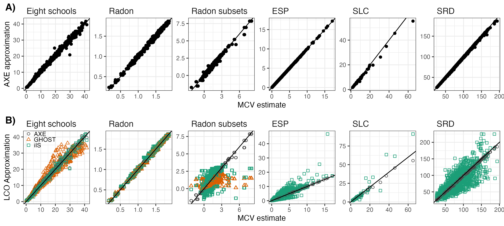

README
================
Amy X. Zhang
11/20/2022

# AXE: (A)pproximate (X)Cross-validated (E)stimates for Bayesian hierarchical regression models

This R package provides code and data to reproduce all examples from the
paper

Zhang, A. X., Bao, L., & Daniels, M. J. (2020). Approximate
Cross-validated Mean Estimates for Bayesian Hierarchical Regression
Models. [*arXiv preprint
arXiv:2011.14238*](https://arxiv.org/abs/2011.14238).

The paper presents a novel method for approximating $E[Y_j | Y_{-j}]$,
the cross-validated posterior mean for vector of test data $Y_j$ given
the vector of training data $Y_{-j}$. The method applies to any CV
scheme; we compared AXE specifically to existing CV approximations
methods under the challenging leave-a-cluster-out CV scheme. In general,
we have found that AXE improves upon existing LCO-CV methods in accuracy
and is typically an order of magnitude faster.

 Figure 2 from the paper gives
point-by-point comparisons of ground truth manual cross-validation
(x-axis) against AXE approximations (panel A, y-axis). Point-by-point
comparisons for other LCO methods integrated importance sampling (iIS)
and ghosting (GHOST) are also included. (Other methdos are omitted to
preserve the scale of the axes; results summarized in Figure 1 of
paper.)

# Code description

The code contains the following directories:

-   `R`: Contains all code to fit models, run manual cross-validation,
    AXE, iIS, GHOST, and VEHTARI. Also contains code helpers functions
    to format results for the paper, as well as helper functions to save
    posterior fits (for use in Python).
-   `python`: Contains code to fit IJ and NS methods, as well as IJ and
    NS results.
-   `pretrained`: Contains files with posterior fit data, for the
    purpose of using in the Python code.
-   `data-raw`: Contains data in raw format, as well as scripts used to
    prepare data.
-   `data`: Contains all datasets and paper results.
-   `stan`: Contains all STAN model code.

The following scripts are also included:

-   `pretrained_models.R`: Fits models to each dataset and saves
    posterior information in `pretrained` directory.
-   `run_examples.R`: Runs all paper examples.
-   `paper_output.R`: Uses data in `data` directory to get paper figures
    and tables.

To use, from within the project directory, load/source the appropriate
files, i.e. in R do:

``` r
for (file in list.files("R")) {
   source(file.path("R", file))
}  # imports all functions for re-running MCV, AXE, or other LCO approximations

for (obj in list.files("data")) {
   load(file.path("data", obj))
} # loads pre-obtained MCV, AXE, and LCO values
```

The main functions in `R` folder are:

-   `prep_*()`: Creates a list with data for each example

    -   `prep_eight()`: Eight schools (LMM)

    -   `prep_radon_full()`: Radon (LMM)

    -   `prep_radon_simul()`: Radon subsets (LMM)

    -   `prep_lol()`: Esports players (GLMM)

    -   `prep_slc()`: Scottish lip cancer (GLMM, CAR)

    -   `prep_air()`: Scottish respiratory disease (GLMM,
        spatio-temporal CAR)

-   `pfit_*()`: Fits model to full data and produces LCO approximations,
    based on posterior samples, for iIS, Vehtari, and GHOST methods.

-   `axe_*()`: Uses co/variance posterior means to produce AXE
    estimates.

-   `mcv_*()`: Runs manual cross-validation and saves $E[Y_j | Y_{-j}]$.

Example results are obtained by calling the above functions for each
example in turn, e.g. the Eight schools results are generated using the
following code:

``` r
eight <- prep_eight() 
eight$cv_yhats  <- mcv_eight() 
eight$posteriors <- pfit_eight() 
eight$axe_yhats <- axe_eight() 
```

The object `eight` is available in the package, listed in the `data`
folder. Each of the paper’s examples is saved in `data` under the
following names:

-   `eight`: Eight schools

-   `radon_1`: Radon

-   `radon_2`: Radon subsets

-   `lol`: Esports players

-   `slc`: Scottish lip cancer

-   `air`: Scottish respiratory disease
