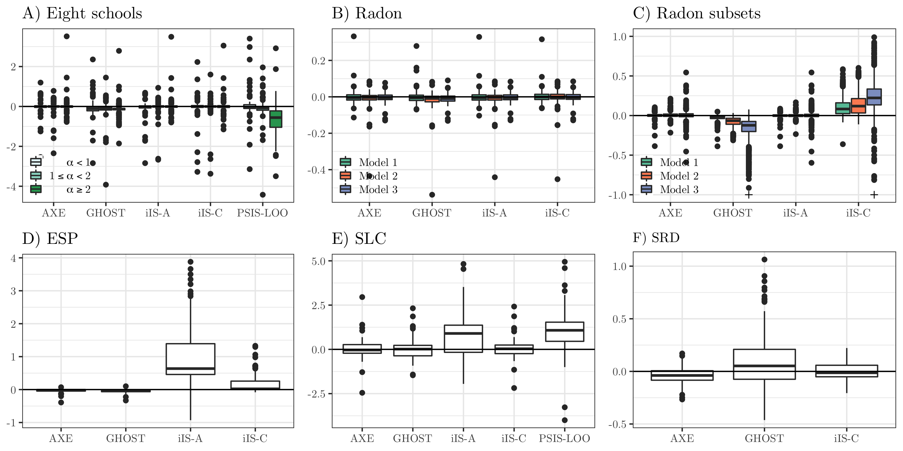

# AXE: (A)pproximate (X)Cross-validated (E)stimates for Bayesian hierarchical regression models

This R package provides all code and data to reproduce the examples from our paper

Zhang, A. X., Bao, L., & Daniels, M. J. (2020). Approximate Cross-validated Mean Estimates for Bayesian Hierarchical Regression Models. [_arXiv preprint arXiv:2011.14238_](https://arxiv.org/abs/2011.14238).

In short, AXE is a fast and accurate method for approximating $E[Y_j | Y_{-j}]$, where $Y_j$ is the vector of test data, and $Y_{-j}$ a vector of training data. We have generally found it to improve upon existing CV approximation methods and is an order of magnitude faster than other CV methods for leave-a-cluster-out CV. By conditioning on the variance-covariance parameters, we shift the CV problem from probability-based sampling to a simple and familiar optimization problem.

 Let $Y \in I\!\!R^N$ denote a continuous response vector that follows

$$ Y | \beta, \tau \sim N(X_1\beta_1 + X_2\beta_2, \tau^2I), \\
 \beta_1 \sim N(\alpha_1, C), \quad \beta_2 | \Sigma \sim N(\alpha_2, \Sigma), \\
 \Sigma  \sim f(\Sigma), \quad \tau \sim f(\tau),
$$

where 

- $C \in I\!\!R^{P_1 \times P_1}$ is positive-definite and typically a diagonal matrix,

- $\Sigma \in I\!\!R^{P_2 \times P_2}$ is positive-definite, 

- $\tau \in I\!\!R_+$

- $X \coloneqq \begin{bmatrix}X_1 & X_2\end{bmatrix} \in I\!\!R^{N\times P}$ is the design matrix,

- $\beta_1 \in I\!\!R^{P_1}$ denote fixed effects, $\beta_2 \in I\!\!R^{P_2}$ random effects s.t. $\beta \coloneqq \begin{bmatrix}\beta_1' & \beta_2'\end{bmatrix}' \in I\!\!R^{P}$, 

- WLOG, $\alpha_1 = \alpha_2 = 0.$ 


AXE approximates cross-validated mean estimates using the posterior means for $\hat{\Sigma}$ and $\hat{\tau}$ as plug-in estimates. Let us refer to $j$ as the test data indices, so $Y_j$ denotes the vector of test data and $Y_{-j}$ the vector of training data. The AXE approximation for CV mean estimate $E[Y_j | Y_{-j}]$ is
$$
    \hat{Y}_{j}^{\text{AXE}} = E[X\beta | Y_{-j}, \hat{\Sigma}, \hat{\tau}] = \frac{1}{\hat{\tau}^{2}}X_j\left(\frac{1}{\hat{\tau}_{-j}^{2}}X_{-j}'X_{-j} + \begin{bmatrix}0 & 0 \\ 0 & \Sigma^{-1}\end{bmatrix}\right)^{-1}X_{-j}'Y_{-j}.
$$

The basic reasoning is: @kass1989approximate showed that  $E[\beta | Y] = E[\beta | Y, \hat{\tau}_{\text{EB}}, \hat{\Sigma}_{\text{EB}}]\left(1 + \mathcal{O}\left({P_2^{-1}}\right)\right)$, where $\hat{\tau}_{\text{EB}}, \hat{\Sigma}_{\text{EB}}$ denote the Empirical Bayes estimates. That is, the conditional posterior given variance parameters can approximate the posterior mean for $\beta$ when $P_2$ is large enough (whether $P_2$ is large enough can be determined by deriving $E[X\beta| \hat{\Sigma}, \hat{\tau}, Y]$ and comparing to the posterior mean estimates). Then, so long as the posterior means $\hat{\Sigma}$ and $\hat{\tau}$ are stable enough across cross-validation folds, they can be used as plug-in estimates in the conditional mean in $E[X\beta | Y_{-j}, \hat{\Sigma}, \hat{\tau}]$ to produce approximations of   $E[X\beta | Y_{-j}]$. 
A

XE shifts the CV problem to the same form as maximum likelihood methods for simple linear regression} and is likewise $\mathcal{O}\left(N^2P + P^3 right)$ in time for each CV fold. It can be adapted to generalized linear mixed models (GLMMs) and it can be used with any CV schema, e.g. K-fold, leave-one-out (LOO), and leave-one-cluster-out (LCO). 

# Generalized Linear Mixed Models (GLMMs)

Essentially, we use expectation propagation with a Gaussian approximating density, which allows us to use the same equations as the LMM case, just with the transformed response and variance parameters. 

Take as example a one-way GLMM with clustered response data $Y_{j}$, where $j$ denotes the $j^{th}$ cluster, $n_j$ the size of the cluster, and $t = 1, \dots, n_j$ indexes values within the $j^{th}$ cluster. The data $Y_{jt}$ have some probability density function $\pi$ and are modeled as a regression through link function $g$ so that
\begin{align*} 
    Y_{jt} | X_j\beta &\sim \pi(g^{-1}(X_j\beta)),\\
    \beta | \Sigma &\sim N\left(0,  \Sigma \right), \quad \Sigma \sim f(\Sigma),
\end{align*}
where $ E[Y_{jt} | X_j\beta] = g^{-1}(X_j\beta)$ and $v_j \coloneqq  -1/\pi''(g^{-1}(X_j\beta)) = \text{var}(Y_{jt})$. Then taking the normal approximation with equivalent moments converges as $n_{j}$ becomes large:
\begin{align} \label{eqn:glmm_approx}
Y_{jt} &\approx N(g^{-1}(X_j\beta), v_{j}) \notag \\
g(Y_{jt}) &\rightarrow N\left(X_j\bm{\beta},
\frac{v_{j}} {g'(g^{-1}(X_j\bm{\beta}))^{2}}\right) \quad \text{ as }n_{j} \rightarrow \infty.
\end{align}

Denote in \ereft{eqn:glmm_approx} the transformed response $g({Y_{jt}})$ as $Y_{jt}^g$, the variance as $\tau_{j}^2$, the diagonal matrix of $\tau_{j}^2$'s as $P(\bm{\beta})$, and the normal approximation as $f_N(Y_{jt}^g | X_j\bm{\beta}, P(\bm{\beta}))$. When $\Sigma$ and $\beta$ are unknown, we plug in the marginal posterior mean $\hat{\Sigma} = E[\Sigma|Y]$ and $\hat{\beta} = E[\beta|Y]$. Then,
\begin{align*}
X\beta |Y^g,\hat{\Sigma},P(\bm{\hat{\beta}}) &\sim N_p(m, V)
\\
V &= \left(X'P(\hat{\beta})^{-1}X + \begin{bmatrix}C^{-1} & 0 \\ 0 & \hat{\Sigma}^{-1}\end{bmatrix}\right)^{-1} 
\notag \\
m &= XVX'P(\hat{\beta})^{-1}Y^g. \notag
\end{align*}


# Examples



This figure compares the log ratio of RMSE for each method vs ground truth RMSE (closer to 0 is better). 


This figure gives point-by-point comparisons of ground truth manual cross-validation (x-axis) against AXE approximations (panel A, y-axis). Point-by-point comparisons for other LCO methods iIS-C and GHOSt are also included. 

# Code
The R package here bundles together all code used to produce the examples in the paper. To use, 

```{r}
library(devtools)
install_github()

```

- `prep_*()`: Creates a list with data for each example
   + `prep_eight()`: Eight schools (LMM)
   + `prep_radon_full()`: Radon (LMM)
   + `prep_radon_simul()`: Radon subsets (LMM)
   + `prep_lol()`: Esports players (GLMM)
   + `prep_slc()`: Scottish lip cancer (GLMM, CAR)
   + `prep_air()`: Scottish respiratory disease (GLMM, spatio-temporal CAR)
- `pfit_*()`: Fits model to full data and produces LCO approximations, based on posterior samples, for iIS-A, iIS-C, and GHOST.
- `axe_*()`: Uses co/variance posterior means to produce AXE estimates.
- `mcv_*()`: Runs manual cross-validation and saves $E[Y_j | Y_{-j}]$.

For examples of use and code to produce paper figures, see the `overview.Rmd` vignette.


